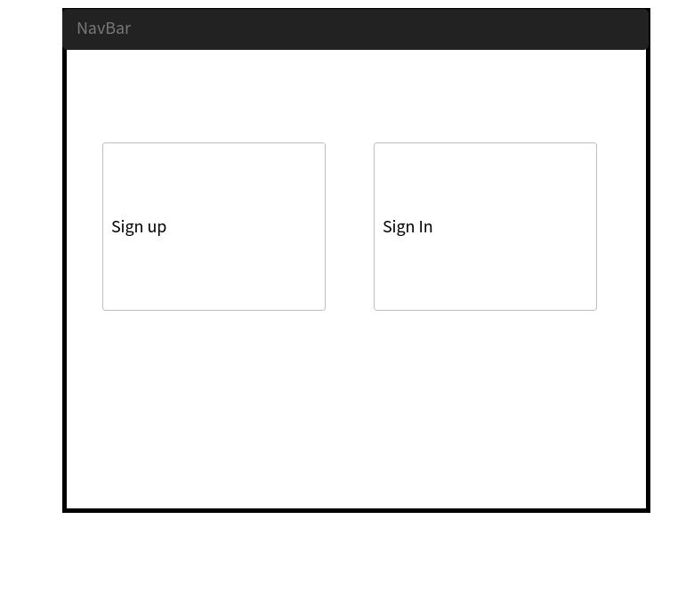

# Chatroom App - Express API

## App Summary
This is the back-end to an application that is an instant messaging platform. It stores user authentication material and connects with a MongoDB database. It also stores messages and has socket.io software that allows instantaneous messaging on the front-end.

#### Technologies
Javascript, Express

MongoDB, Mongoose

Socket.io

Heroku, NodeJS, Git & Github for Version Control

## Links
**Deployed front-end client:** https://sei-04-team-3.github.io/group-project-client/

**Front-end client repository:** https://github.com/sei-04-team-3/group-project-client

**Deployed back-end API:** https://floating-lowlands-13889.herokuapp.com

**Back-end API repository:** https://github.com/sei-04-team-3/group-project-api

## Resource Routes
`user routes`:
  - `/sign-up` - POST for sign up credentials
  - `/sign-in` - POST for sign in credentials
  - `/users` - GET for list of users
  - `/change-password` - PATCH for updating credentials
  - `/sign-out` - DELETE for sign out

`message routes`:
  - `/messages` - GET for index of messages
  - `/messages/:id` - GET for individual message (not used, but can be)
  - `/messages` - POST for message creation (applies ownership)
  - `/messages/:id` - PATCH for editting message (requires ownership)
  - `/messages/:id` - DELETE for deleting message (requires ownership)

## Development documentation

### Wireframes && User stories && ERDs

Wireframes

User Stories

As an unregistered user, I would like to sign up with email and password.

As a registered user, I would like to sign in with email and password.

As a signed in user, I would like to change password.

As a signed in user, I would like to sign out.

As a signed in user, I would like to join a chat room.

As a signed in user in a room, I would like to see all messages in the chat room.

As a signed in user in a room, I would like to send my own messages to the chat room.

As a signed in user in a room, I would like to update my own messages to the chat room.

As a signed in user in a room, I would like to delete my own messages to the chat room.

ERD

`Users` -|--< `Messages`

**User** has many **Messages**

### API - Backend
##### Setup and intialize to local/remote and heroku
Change information, where need be, with proper project name.
   - `config/db.js` contains mongoose database name
   - `npm install` to install proper dependencies

##### Project planning
Divide team members into different roles

Product Lead: Moises Herrera
Front-End Lead: David Tersoff
Back-End Lead: Marc Pelve
Quality Assurance: Kimberly Wilkes

1. Brainstorm
2. Wrote User Stories and WireFrames
3. Assign Roles
4. Divide into two primary teams:
  1. Back-End Functionality and Front-End Connecting with Back-End/AJAX/Other Software/Socket.io - Marc Pelve & Moises Herrera
  2. Front End Aesthetic and Design, Handlebars, Keeping Code Clean, Styling, Proving Back-End with necessary features, overall User Experience.
5. Team Began with the Back-End
  1. Front-End Team Tackled creating Models for Messages
  2. Back-End Team Tackled creating routes and adding to server.js.
6. Implement Socket.io for client/server communication led by Marc Pelve

##### Resource planning
Create resource required for project.
- `User` resource provided for authentication
- `Message` resource to be created as primary resource
  - Protected resource will require ownership as middleware

  `Users` -|--< `Messages`

  **User** has many **Messages**

  <table style="display:inline">
  <th colspan="2" style="text-align:center">Messages</th>
  <th colspan="2" style="text-align:center">User</th>
  <tr>
  <td>_id</td>
  <td>MongoDB generated</td>
  <td>_id</td>
  <td>MongoDB generated</td>
  </tr>
  <tr>
  <td>text</td>
  <td>string</td>
  <td>email</td>
  <td>string</td>
  </tr>
  <tr>
  <td>owner</td>
  <td>ref to user</td>
  <td>hashedPassword</td>
  <td>string</td>
  </tr>
  <tr>
  <td></td>
  <td></td>
  <td>token</td>
  <td>string</td>
  </tr>
  <tr>
  <td></td>
  <td></td>
  <td>role</td>
  <td>string: default 'member'</td>
  </tr>
  <tr>
  <td>timestamps</td>
  <td>datetime</td>
  <td>timestamps</td>
  <td>datetime</td>
  </tr>
  </table>

##### End Point Testing
Postman requests to test early in development

<ul style="list-style-typenone;">
  <li>get -> #index, #show</li>
  <li>post -> #create</li>
  <li>patch -> #update</li>
  <li>delete -> #destroy</li>
</ul>

### Project problem realizations
Sockets were going to be a necessary requirement to have some sort of listening/emiting system that the server and the client can communicate on a continuous basis that weren't always done over the standard HTTP request routes. Socket.io was the choice for that however it came with the problem that there were few examples of how to use their package for more intricate purposes. Nonetheless, it is the component of the app that emits and listens to give it that instant message appeal.

#### Potential updates
1. Make multiple chat rooms / create chatroom a possibility
2. Private messaging / create private chatrooms
3. Use 3rd party API for more app functionality without having to reinvent the wheel
